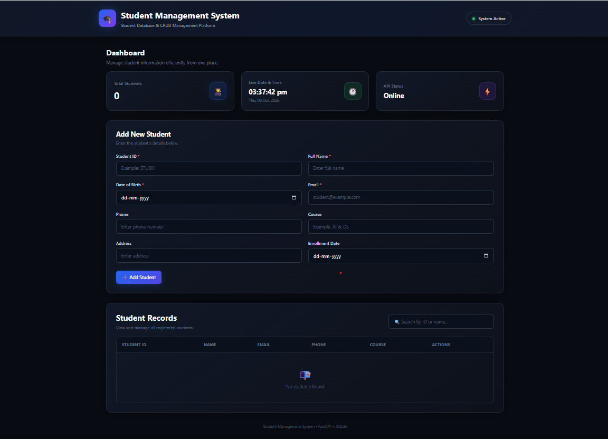
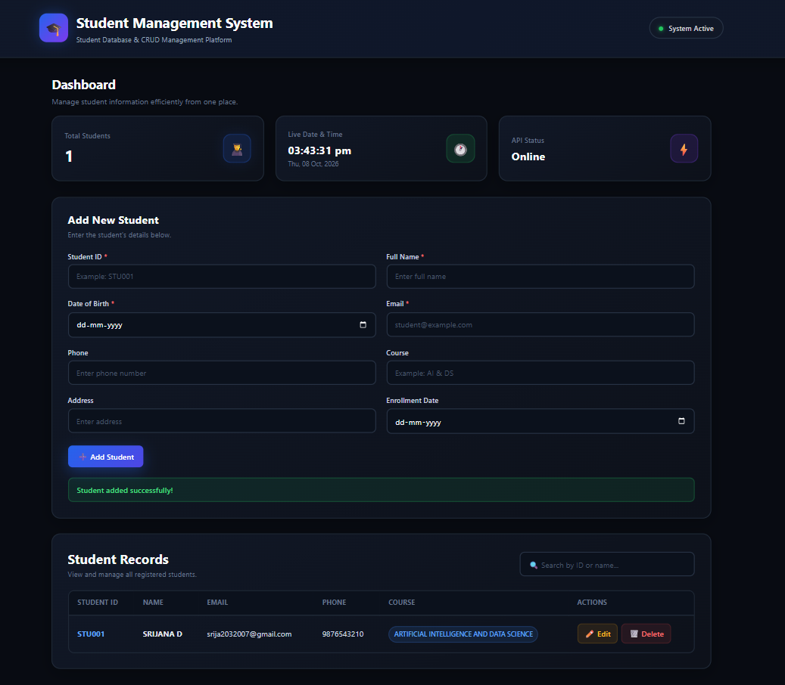
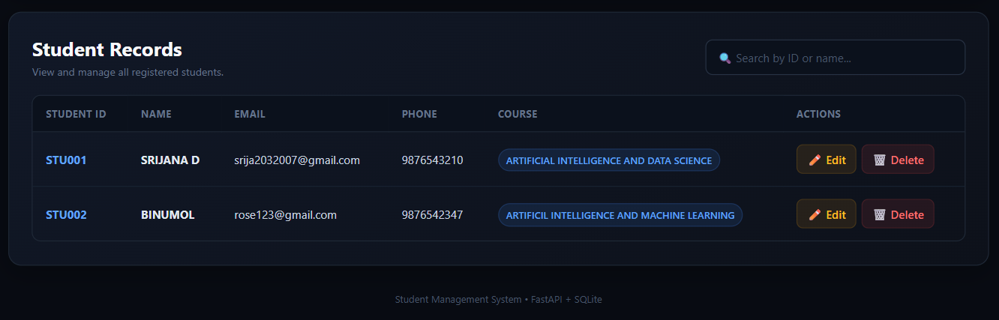
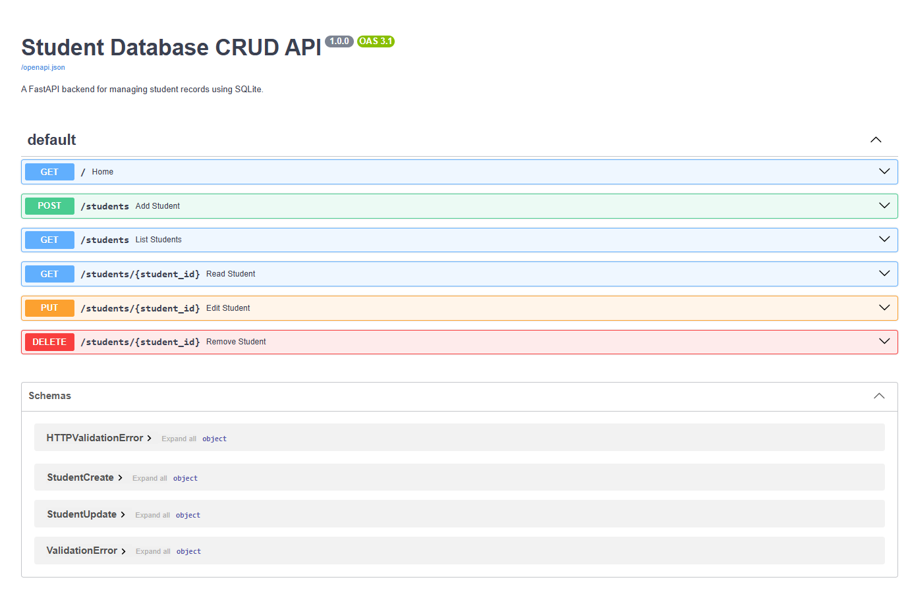
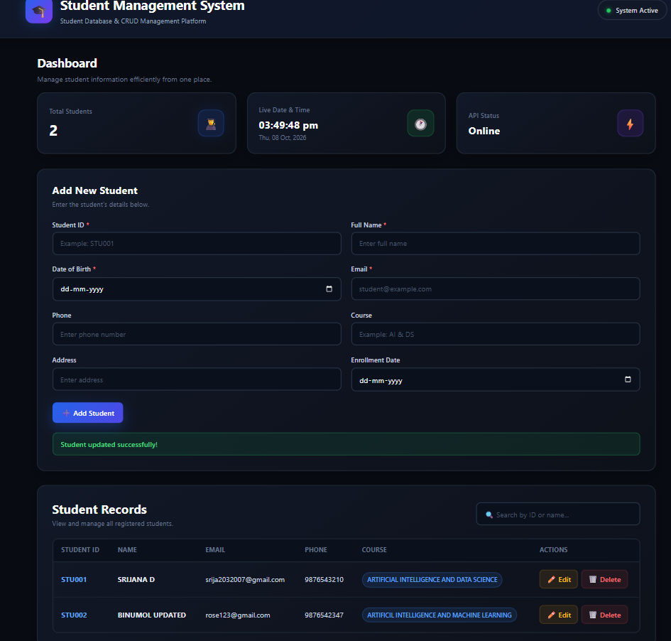

# Student Database CRUD Application

A Student Management System built using Python, FastAPI, SQLite, HTML, CSS, and JavaScript.

## Project Overview

This project is an individual backend development project created as part of the EWB Edu Tech Pvt. Ltd. internship program.

The application provides a web-based system to manage student records using Create, Read, Update, and Delete (CRUD) operations.

The backend is developed using FastAPI and SQLite is used for persistent data storage.

## Project Objective

The main objective of this project is to build a functional student database application that can:

- Create student records
- Read and list student records
- Retrieve an individual student
- Search and filter student records
- Update existing student details
- Delete student records
- Store data persistently using SQLite
- Validate user input
- Handle missing student records properly

## Technologies Used

- Python
- FastAPI
- SQLite
- Pydantic
- HTML
- CSS
- JavaScript
- Jinja2
- Uvicorn

## Features

### Student Management

The application allows users to add student details including:

- Student ID
- Full Name
- Date of Birth
- Email
- Phone
- Course
- Address
- Enrollment Date

### CRUD Operations

| Operation | Method | API Endpoint |
|---|---|---|
| Create Student | POST | `/students` |
| Get All Students | GET | `/students` |
| Get Student | GET | `/students/{student_id}` |
| Update Student | PUT | `/students/{student_id}` |
| Delete Student | DELETE | `/students/{student_id}` |

### Search and Filtering

The application supports searching and filtering student records using:

- Student Name
- Course

### Input Validation

The application uses Pydantic for request validation.

Email addresses are validated using `EmailStr`.

The application also handles:

- Duplicate Student IDs
- Duplicate email addresses
- Missing student records
- Invalid email format
- Invalid request data

### Web Interface

The project includes a professional web interface with:

- Dashboard
- Total student count
- Live date and time
- API status
- Student registration form
- Student records table
- Search functionality
- Edit functionality
- Delete functionality
- Refresh functionality
- Success and error messages

## Project Structure

```text
Student_Database_CRUD/
│
├── main.py
├── database.py
├── schemas.py
├── crud.py
├── models.py
├── requirements.txt
├── README.md
├── .gitignore
│
├── screenshots/
│   ├── dashboard.png
│   ├── add-student.png
│   ├── student-records.png
│   ├── swagger-api.png
│   └── crud-testing.png
│
└── templates/
    └── index.html
    
    ## Screenshots

### Dashboard



### Student Registration



### Student Records



### Swagger API Documentation



### CRUD Testing

